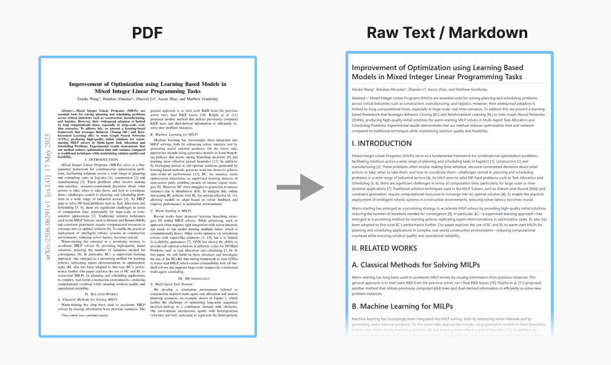
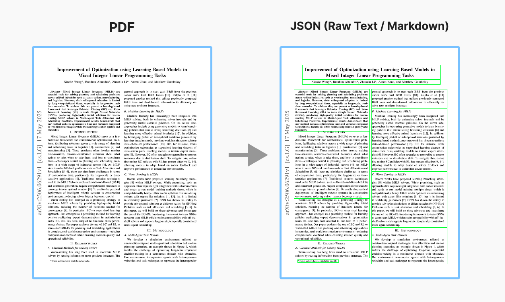

# 📃 Extensive List of Document Parsers

- 🚧 THIS IS A WORK IN PROGRESS! More will be added soon!
- Feel free to contribute by submitting a pull request 🙏
- Cells marked with ✅ or ❌ have been independently tested. Blank cells indicate that the feature has not yet been independently tested.
- See the `results` folder to see the outputs from models.

## PDF-to-Text Converters

### Machine-generated Documents only

| Models                                                | GitHub                                                                                   | Output   | Table                   | Equation | Figure | Handwriting | Two columns | Multiple columns |
| ----------------------------------------------------- | ---------------------------------------------------------------------------------------- | -------- | ----------------------- | -------- | ------ | ----------- | ----------- | ---------------- |
| [PyMuPDF](https://docling-project.github.io/docling/) |    | Raw text | ❌                      | ❌       | ❌     | ❌          | ✅          | ❌               |
| [PDFPlumber](https://github.com/jsvine/pdfplumber)    |  | Raw text | ✅ (separate from text) | ❌       | ❌     | ❌          | ❌          | ❌               |

### Machine-generated and Scanned Documents

| Models                                                                                                            | GitHub                                                                                                                                                                                                                                                                           | Output   | Table         | Equation | Handwriting | Two columns | Multiple columns |
| ----------------------------------------------------------------------------------------------------------------- | -------------------------------------------------------------------------------------------------------------------------------------------------------------------------------------------------------------------------------------------------------------------------------- | -------- | ------------- | -------- | ----------- | ----------- | ---------------- |
| [Marker](https://github.com/datalab-to/marker)                                                                    |                                                                                                                                                  | Markdown | ✅ (markdown) | ✅       | ✅          | ✅          | ❌               |
| [Nougat](https://facebookresearch.github.io/nougat/)                                                              |                                                                                                                                      | Markdown | ❌            | ✅       | ✅          | ✅          | ❌               |
| [MinerU](https://mineru.net/)                                                                                     |                                                                                                                                                | Markdown | ✅ (html)     | ✅       | ❌          | ✅          | ❌               |
| [Llamaparse (balanced mode)](https://docs.cloud.llamaindex.ai/llamaparse/presets_and_modes/advance_parsing_modes) | -                                                                                                                                                                                                                                                                                | Markdown | ✅ (markdown) | ❌       | ❌          | ✅          | ❌               |
| [Llamaparse (premium mode)](https://docs.cloud.llamaindex.ai/llamaparse/presets_and_modes/advance_parsing_modes)  | -                                                                                                                                                                                                                                                                                | Markdown | ✅ (markdown) | ❌       | ❌          | ✅          | ❌               |
| [Docling](https://docling-project.github.io/docling/)                                                             |                                                                                                                                      | Markdown | ✅ (markdown) | ❌       | ❌          | ✅          | ✅               |
| [RolmOCR](https://huggingface.co/reducto/RolmOCR)                                                                 |                                                                                                                                             | Markdown | ✅ (markdown) | ✅       | ✅          | ✅          | †                |
| [olmOCR](https://olmocr.allenai.org/)                                                                             |                                                                                                                                                        | Markdown | ✅ (markdown) | ✅       | ✅          | ✅          | †                |
| [Unstructured](https://unstructured.io/)                                                                          |                                                                                                                            | Raw text | ❌            | ❌       | ❌          | ❌          | ✅               |
| [Pytesseract](https://pypi.org/project/pytesseract/)                                                              |                                                                                                                                              | Raw text | ❌            | ❌       | ❌          | ✅          | ✅               |
| [Amazon textract](https://docs.aws.amazon.com/managedservices/latest/userguide/textract.html)                     | -                                                                                                                                                                                                                                                                                |          |               |          |             |             |                  |
| [Azure AI Document Intelligence](https://azure.microsoft.com/en-us/products/ai-services/ai-document-intelligence) | -                                                                                                                                                                                                                                                                                |          |               |          |             |             |                  |
| [Google Cloud OCR](https://cloud.google.com/document-ai/docs/enterprise-document-ocr)                             | -                                                                                                                                                                                                                                                                                |          |               |          |             |             |                  |
| [Mathpix](https://mathpix.com/convert)                                                                            | -                                                                                                                                                                                                                                                                                |          |               |          |             |             |                  |
| [MarkItDown](https://github.com/microsoft/markitdown)                                                             |                                                                                                                                            |          |               |          |             |             |                  |
| [MistralOCR](https://mistral.ai/news/mistral-ocr)                                                                 | -                                                                                                                                                                                                                                                                                |          |               |          |             |             |                  |
| [Upstage](https://www.upstage.ai/products/document-parse)                                                         | -                                                                                                                                                                                                                                                                                |          |               |          |             |             |                  |
| [OmniAI](https://getomni.ai/)                                                                                     | -                                                                                                                                                                                                                                                                                |          |               |          |             |             |                  |
| [ChatDoc PDF parser](https://pdfparser.io/)                                                                       | -                                                                                                                                                                                                                                                                                |          |               |          |             |             |                  |
| [Reducto](https://app.reducto.ai/)                                                                                | -                                                                                                                                                                                                                                                                                |          |               |          |             |             |                  |
| [OCRFlux](https://ocrflux.pdfparser.io/#/)                                                                        |                                                                                                                                              |          |               |          |             |             |                  |
| [Nanonets](https://nanonets.com/research/nanonets-ocr-s/)                                                         |                                                                                                                                     |          |               |          |             |             |                  |
| [MonkeyOCR](https://github.com/Yuliang-Liu/MonkeyOCR)                                                             |   |          |               |          |             |             |                  |
| [PaddleOCR](https://paddlepaddle.github.io/PaddleOCR/latest/en/index.html)                                        |                                                                                                                                        |          |               |          |             |             |                  |
| [ClovaOCR](https://api.ncloud-docs.com/docs/en/ai-application-service-ocr)                                        | -                                                                                                                                                                                                                                                                                |          |               |          |             |             |                  |
| [ParseExtract](https://parseextract.com/)                                                                         | -                                                                                                                                                                                                                                                                                |          |               |          |             |             |                  |

† Process took too long

# Layout Parsers

🚧 Coming soon
