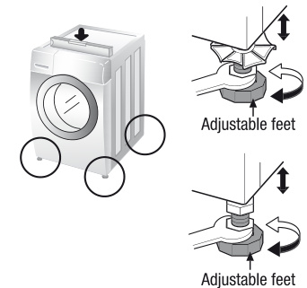

# Installation of drain hose  

Warning: Before cleaning the washing machine interior, unplug the electrical power cord to avoid the risk of electric shock.

Cleaning the water inlet filter  

Cleaning the drain pump filter  

  

  
Cleaning the dispenser drawer  

# Cleaning and Maintenance  

- Items that have been spotted or soaked with vegetable or cooking oil constitute a fire hazard and should not be placed in a tumble dryer. Oil-infested items can spontaneously ignite, especially when exposed to hot sources such as in a tumble dryer. The items become warm, causing an oxidation reaction in the oil. Oxidation creates heat. If the heat cannot escape, the items can become hot enough to catch fire. Fire, smoking or carbon monoxide poisoning can result if the item is not removed. Items that are made of materials that contain vegetable or cooking oil or have been contamination by hair care products be placed in a tumble dryer should first be washed in hot water with extra detergents this will reduce, but not eliminate, the hazard. The "cool down" cycle of tumble dryers should be used to reduce the temperature of the item before it is placed in the tumble dryer. Items that have been previously cleaned in, washed in, soiled or operated with petrol/gasoline, oil, dry cleaning solvents or other inflammatory or explosive substances should not be placed in a tumble dryer. Highly flammable substances commonly used in domestic environments include acetone, diisobutyl alcohol, petrol/gasoline, kerosene, spirit removers (some brands), turpentine, waxes and wax removers. Items containing metal objects should not be placed in a tumble dryer. Items containing metal objects should be placed in a tumble dryer on a hot setting. Foam rubber materials can, when heated, produce fire by spontaneous combustion. Fabric softeners or similar products should not be used during a drying cycle, to eliminate the effects of static electricity which often causes static discharges. Undergarments that contain metal reinforcement should not be placed in a tumble dryer. Damage to the tumble dryer can result if metal reinforcement becomes loose during drying. When available a drying rack could be used for such items. Plastic, rubber and rubberized items should not be placed in a tumble dryer. Rubber backed articles, clothes dried with rubber based pastes, rubber, rubberized rubber and rubber coated rubber articles should not be placed in a tumble dryer.  

Antrous objects such as holes or shallow pits impact in beams or beams. Never make cuts that produce a flapping island. This is usually normal. Bevel all contact pads and beveling must be removed. Track and lightening have consequences. Unbeveling pads. Contact planner if necessary. Do not disassemble parts or unsuitable surfaces.  

<html>
<table><tr><td>1</td><td>2</td><td>3</td><td>4</td></tr><tr><td>Pull out the dispenser drawer</td><td>Clean the dispenser drawer under flowing water</td><td>Clean inside the recess with an old toothbrush</td><td>Insert the dispenser drawer</td></tr><tr><td colspan="4">Once you have finished cleaning, replace the drawer and turn on the cycle without laundry or soap.</td></tr></table>
</html>  

  
Level adjustment  

Cleaning in general Important: Do not use methylated spirits, solvents or similar products.  

Extra care of your washing machine can extend its service life. The outside of the machine can be cleaned with warm water and a neutral non-abrasive household detergent. Immediately wipe off any fingerprints and use with damp cloth. Avoid etching the surface with sharp objects. Never leave down the machine.

Dry around the washing machine door opening, flexible gasket and door glass. Run washing machine through a complete cycle using hot water. Replaced filters if necessary.  

  

- The drain hose should not be placed higher than 100 cm above the floor.
- Proper securing of the drain hose will protect the floor from damage due to any water leakage.
- If the drain hose is too long do not force back into the washing machine. This will cause abnormal noise and cause the machine to malfunction and leak.  

- Proper level adjustment of the washing machine prevents excessive noise and vibration. Install the appliance on a solid and level floor surface, preferably in a corner of the room.  

- If the floor is uneven, adjust feet as required. (Do not insert pieces of wood etc. under the feet). Make sure that all four feet are stable and resting on the floor. Then check that the appliance is perfectly level. (Use a spirit level).  

To minimize the risk of fire within the inner bowl, the following should be observed:  

# Electrical connection  

# BS Plug Safety Details (For U.K. User)  

# Wooden floors (Suspended floors)  

# Safety instructions for use Safety instructions for use  

This appliance must be earthed As the colours of the wires in the mains lead of this apparatus may not correspond with the coloured markings identifying the terminals in your plug, proceed as follows: The green and yellow wire must be connected to the terminal in your plug marked with the letter G or coloured green and yellow. The wire coloured blue must be connected to the terminal marked with the letter B or coloured black. The wire coloured brown must be connected to the terminal marked with the letter L or coloured red. If a 13 amp (BS 1362) plug is used, fit a 13 amp BS 1362 fuse.  

To prevent vibration we recommend you place 2 rubber cups under each foot, at least 15mm thick under the washer, secured to at least 2 floor beams with screws. If possible install the washer in one of the corners of the room, where the floor is more stable. Insert the rubber cups to reduce vibration. You can obtain the rubber cups (p/n A620E94008) from the LG spares shop!  

Read all instructions and explanations of the installation before use. Follow the instructions carefully. Keep the operating instructions handy for later use. If the appliance is sold or passed on then ensure that the new owner always receives these operating instructions. The following warnings must be strictly observed for safety reasons. They must be read before installing the appliance and putting it into operation.  

- The hose supplied with the machine must be used. Old hoses may not be received.
- The appliance is not intended for use by young children or infirm persons without supervision.
- Young Children should be supervised to ensure that they do not play with appliance.  

Install or store the appliance where it will not be exposed to sub-zero temperatures or exposed to the weather. Fit the power plug to a grounded wall socket that complies with all statutory regulations and ordinances. Ensure that the base opening is free from obstruction to prevent moisture condensation. Do not leave the appliance in a position to risk cockroach infestation or other vermin, pay particular attention to keep the appliance and its surroundings in a clean condition at all times. Any damage which may be caused by cockroaches or other vermin is not covered by the appliance guarantee.  

- Intended use: This appliance has been designed exclusively for use in dry-interior households. Use the appliance only with coin checking soaps and only for washing clothes with washing detergents designed for washing machines. Every other use is impractical and may lead to injuries, whereby the stability of the machine can cause.
- This appliance may only be used by adults. Do not allow children to touch the controls or to play with the product.
- Never modify the appliance on your own, as this is dangerous.  

1. Do not use an extension cord or double adapter.
2. Have damaged supply cords replaced by the manufacturer or its service agents or a similarly qualified person to prevent damage.
3. Always plug the machine and turn off the water supply after use.
4. Connect the machine to an earthed socket in accordance with current wiring regulations.
5. The appliance must be positioned so that the plug is easily accessible.
6. If required, have the machine checked by a qualified electrical engineer or electrician or technical personnel. Repairs carried out by inexperienced persons may cause injury or serious malfunctioning. Contact your local service centre.
7. Do not install your washing machine in rooms where temperature below freezing may occur. Frozen fumes may burst under pressure and cause fire or carbon monoxide poisoning. Do not store chemicals below freezing point.
8. If the appliance is delivered in the winter months and temperatures are below freezing, leave the washing machine standing at room temperature for a few hours before putting it into operation.
Caution  

- Remove all packaging and transport tools before using the appliance. Otherwise serious damage may result.
- All installation work must be carried out by a qualified fitter or technician.  

- Please provide us with your application
- Please send the application on file upon request  

Disposal

- When this crossed-out wheeled bin symbol is attached to a product it means the product is covered by European Directive 2002/96/EC.
- All electrical and electronic products should be disposed of separately from municipal waste stream (Waste Paper) and must be collected and disposed of by the government or the local authorities.
- The correct disposal of your old appliance will help prevent potential adverse consequences for the environment and human health.
- For more information about disposal of your old appliance, please contact your city office, waste disposal service or the shop where you purchased the product.  

- If the appliance is placed on a carpet then place the feet so that air can circulate underneath the appliance.
- Always plug the machine and turn off the water supply after use. Disconnect appliance by pulling only the plug - never disconnect by pulling the power cord. Never touch the plug with wet fingers or hands.
- The plug is connected like a cable.  

CAUTION about positioning the appliance  

- Never place electrical heaters, condensers or fuses (tiny fuses usually installed in cars, trucks, buses and airplanes) on the floor.
- Never place electrical heaters, condensers or fuses in the vicinity of the appliance. They could cause the appliance to light up or parts to warp.
- Protect the appliance from wet and damp. Otherwise, there is danger of electric shock and fire.
- Contact the appliance maker to establish warranty for 20/24 hours. Do not use an extension cord or other electrical adapter.
- Empty the appliance of any liquid that may be present, either in the case of storage or stories that may cause sensor damage.
- Unbalanced mass may create heavy vibrations. If heavy vibrations remain or are not load, call for an authorized customer service.
- Do not wash or dry articles that have been cleaned in, washed in, soaked in, or dried with combustible or explosive substances. Such as paint, oil, kerosene, and other flammable or explosive materials. Do not use water to flush the machine. If a person has been used to make sure that the solvent has been carefully washed out before inserting the clothes into the appliance. Air may remain in the HFO after a whole cycle resulting in fire during drying. So do not load too heavy articles.
- Do not use the machine in areas where flammable or explosive substances are present such as oil, benzene or highly inflammable gas. Such materials may cause fire or explosion. Never use combustible or explosive materials.
- Only add the prescribed amount of softener. Excessive amounts may damage the clothes.
- After washing, leave the drum door open in order the cloths can  

Install the washing machine on a flat hard floor. Make sure that air circulation around the washing machine is not impeded by carpets, rug etc.  

- Never try to correct any unevenness in the floor using pieces of wood, cardboard or similar materials under the washing machine.
- If it is not possible to position the washing machine away from a gas cooker or coal burning stove, an insulation panel (856x856x100 mm) must be installed between the two appliances.
- The washing machine must not be installed in rooms where the temperature may drop below 0°C.
- Please ensure that when the washing machine is installed, that a Service Technician can gain easy access in the event of a breakdown.
- Adhere to four feet using the transit bolt spanner provided to ensure that the appliance is stable, with 20mm clearance between the legs of the washing machine and underside of the machine.  

# CAUTION about the power cord  

We recommend connecting most appliances to a dedicated circuit which is protected by a mains fuse. That is, a single outlet supplying power only to the appliance consumed, without any additional outlets or branch circuits. Check the specifications of this device for electrical equipment wall sockets. Overheated wall sockets, loose or damaged wiring or extension cords, tripped power cords, damaged or cracked wire insulation are dangerous. Any of these conditions could result in electric shock or fire. Periodically examine the cord of your appliance, and if its appearance indicates damage or deterioration, unplug it, discontinue use of the appliance, and have the cord repaired with an exact replacement part by an authorized technician. Protect the power cord from physical or mechanical abuse, such as being twisted, pinched, squashed in a jumble of a door, or walked upon. Pay particular attention to plugs, wall outlets, and the point where the conductors enter the appliance.  

ALGORITHM about location and $r$  

# CAUTION about location and moving
This maneuver is not designed for and  

Make sure that all water has run off before opening the door. Never open the door if water still remains. Danger of scalding. Animals and children may get into the washing machine. Do always keep the appliance before using it. During washing, the glass door becomes very hot. Keep children away from the appliance when in operation. Never try to open the door while the machine is in operation. The product should be serviced and repaired only by the authorised customer service using original replacement parts. When disposing of your old machine, the power cable must be capped and the door lock must be made unusable in order to protect children. Never place the machine on a wet or damp surface. If the appliance has been under water then contact the customer service. There is danger of electric shock and fire. The cover cup of the filter as well as the dispenser drawer may not be opened during the operation. Keep oil washing powder and detergents away from children. Danger of poisoning.  

This equipment is not designed for real-time use or for use mobile installations such as caravans, aircraft etc. Turn off the stopcock if the machine is to be left for any length of time (e.g. if you are going on holiday), especially if there is no floor drain (pulp) in the immediate vicinity. If reactivating the appliance use the original packing material. Packaging material (e.g. plastic film, Shearfert®) can be dangerous for children. There is a risk of suffocation! Keep all packaging well away from children and do not allow children to enter.莫 leave the product for three times between first use.  

ATTION about the floor surface  

<html>
<table><thead><tr><td></td><td><b>• Water supply is not adequate in area</b></td><td><b>Check another tap in the house.</b></td></tr></thead><tbody><tr><td rowspan="3"><b><i>1:1</i></b></td><td>• Water supply taps are not completely open.</td><td>Fully open tap.</td></tr><tr><td>• Water inlet hose(s) are kinked.</td><td>Straighten hose(s).</td></tr><tr><td>• The filter of the inlet hose(s) are blocked.</td><td>Check the filter of the inlet hose(s).</td></tr><tr><td rowspan="2"><b><i>0:0</i></b></td><td>• Drain hose is kinked or clogged.</td><td>Clean and straighten the drain hose.</td></tr><tr><td>• The drain filter is clogged.</td><td>Clean the drain filter.</td></tr><tr><td rowspan="4"><b><i>0:1</i></b></td><td>• Load is too small.</td><td>Add 1 or 2 similar items to help balance the load.</td></tr><tr><td>• Load is out of balance.</td><td>Rearrange load to allow proper spinning.</td></tr><tr><td>• The load is out of an imbalance detection and correction system. If individual heavy articles are loaded (e.g. bath mat, both hand towels, and bathrobe), stop spinning or even interrupt the spin cycle altogether.</td><td rowspan="2">The floor should be a solid surface. Adjust the feet so that the machine does not rock from side to side or front to back.</td></tr><tr><td>• If the currency is still too well at the end of the spin cycle, reduce the amount of laundry to balance the load and repeat the spin cycle. Floor is unstable. Feet are not adjusted.</td></tr><tr><td rowspan="2"><b><i>0:2</i></b></td><td rowspan="2">• <b><i>Yes</i></b> → Is the door opened or not completely closed?</td><td>Close the door completely.</td></tr><tr><td># If the “<i>0:2</i>” does not clear, call for service.</td></tr><tr><td rowspan="2"><b><i>0:3</i></b></td><td rowspan="2">• Water overflows due to the faulty water valve.</td><td>Unplug the power plug and call for service.</td></tr><tr><td>Close the water tap.</td></tr><tr><td rowspan="2"><b><i>0:4</i></b></td><td>• Water level sensor has malfunctioned.</td><td>Unplug the power plug.</td></tr><tr><td>• Over load in motor.</td><td>Call for service.</td></tr><tr><td rowspan="2"><b><i>0:5</i></b></td><td rowspan="2">• The washer experienced a power failure.</td><td>Restart the cycle.</td></tr><tr><td>Turn the tap on.</td></tr><tr><td><b><i>0:6</i></b></td><td>• Check water supply.</td><td># If “<i>0:6</i>” is not released, unplug power plug and call for service.</td></tr></tbody></table>
</html>  

- The installation surface must be clean, dry and level.
- Install washing machine on a flat hard floor. Poorly constructed timber base floors can contribute to excessive noise and vibration.
- Proper placement and leveling of the washing machine ensure long, regular and reliable operation.
- The washing machine must be perfectly level and firmly in position.
- It must not "ride-slow" around corners under loads.
- The installation surface must be clean, free from floor wax and other lubricant coatings.
- Do not allow the feet of the washing machine to get wet. If feet of the washing machine get wet, slipping may occur.  

# Troubleshooting  

# Technical Specification  

# Before use please read carefully the safety instructions!  

Check that the door is shut.
Check that foreign objects may be blocking the drain causing the water not to strain out.  

  

<html>
<table><thead><tr><td><b>Name of product</b></td><td><b>Front loading washing machine</b></td><td></td></tr></thead><tbody><tr><td><b>Power supply</b></td><td>220–240 V~, 50 Hz</td><td><b>Max. Watt</b>2100 W (Wash) / 1500 W (Dry)</td></tr><tr><td><b>Size WxDepth mm:</b></td><td>600 x 640 x 850</td><td><b>Capacity</b>8 kg (Wash)/ 4 kg (Dry)</td></tr><tr><td><b>Weight</b></td><td>72 kg</td><td><b>Water consumption</b>90 l</td></tr><tr><td></td><td></td><td><b>Permissible water pressure</b>100–1000 kPa (1.0–10 bar)</td></tr></tbody></table>
</html>  

Walking machine does not start. Machine must be switched on.  

Power cord strap not be plugged in or connection may be loose.  

Thank you for buying an LG fully automatic washing machine. Use this owner's manual carefully, it provides instructions on safe installation, use and maintenance. Keep it handy for future reference of this machine. Make a note of the model and store in a safe place. For the U.K. customer service Tel.: +44-(0) 844 847 4761 (T) 844 847 5454 (F) Fax: +44-(0) 844 847 4761 (F) 1413 LGEUK SERVICE WEB-SITE: http://www.lge.co.uk P/No.: MFL02803821  

# Safety Instructions for the installation  

cause that foreign objects may be blocking the drain causing the water not to drain out. Once started, the door can not be opened for safety reasons. At the end of the cycle or when Start/Stop is pressed, wait one or two minutes before opening the door to allow the electric solenoid mechanism time to cool down.  

Door does not open  

MFLG2580821_0526.PXSI 1-7  

2015.5.26 4:40:28 PM  